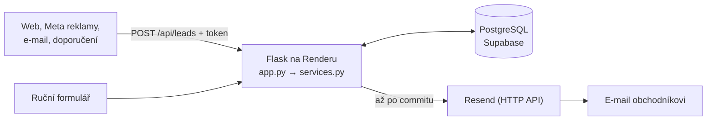

# Lorham: interní systém pro správu poptávek

Prototyp pro firmu, která dostává 100–150 poptávek měsíčně z webu, Meta reklam, e-mailu a doporučení.
Každá poptávka má vlastníka, stav a historii aktivit a je vidět, když se jí nikdo nevěnuje.

## 1. Odkazy

- **Nasazená aplikace:** https://lorham-test.onrender.com/ (běží na free tieru, po nečinnosti usíná, první načtení chvíli trvá)
- **Přihlášení** je v prototypu nahrazené přepínačem **„pracuji jako“** v horní liště: vyberete uživatele a aplikace jedná jeho jménem.

## 2. Jak jsem pochopil problém

Skutečný problém firmy je odpovědnost a rychlost reakce. Neobsloužený lead z Meta reklam je vyhozený reklamní rozpočet.
Při objemu 5–7 poptávek denně nemá smysl řešit škálování. Důležitější je přehlednost a to, aby to lidé opravdu používali, takže systém musí být jednodušší než e-mail.

**Čím to pomáhá:** každá poptávka má od vzniku jmenovitého vlastníka a vedoucí vidí zanedbané poptávky bez ptaní. Dashboard navíc ukazuje průměrnou dobu první reakce po obchodnících, takže zlepšení půjde změřit. Reálný dopad zatím změřený nemám, prototyp běží na ukázkových datech.

## 3. Co systém umí

- **Seznam poptávek** s filtry (stav, obchodník, zdroj, jen zanedbané). Obchodník vidí defaultně „moje“.
- **Detail poptávky** s historií aktivit (hovor, e-mail, schůzka, poznámka), změnou stavu a přiřazením.
- **Ruční založení poptávky.** Obchodníka lze zvolit, nechat vybrat automaticky, nebo nechat nepřiřazeno.
- **Přehled pro vedoucího:** počty podle stavu, obchodníka a zdroje, zanedbané poptávky, průměrná doba reakce a zvýrazněné nepřiřazené poptávky.
- **Automatizace 1, webhook:** `POST /api/leads` (chráněný tokenem, s validací) založí poptávku a hned ji přiřadí obchodníkovi s nejmenším počtem otevřených poptávek.
- **Automatizace 2, e-mail:** nově přiřazený obchodník dostane upozornění se zdrojem, zkráceným textem a odkazem na detail. Doručení jsem ověřil lokálně i na Renderu.
- **SLA příznaky** se počítají při čtení, žádné plánované úlohy. 🔴 **bez reakce** je nová poptávka bez reakce déle než 2 h, 🟠 **usnulá** je otevřená poptávka bez aktivity déle než 3 dny. Zanedbané jsou v seznamu nahoře.
  Reakce je první ruční aktivita nebo změna stavu z „Nová“. Samotné přiřazení se nepočítá, protože přiřazení není kontakt se zákazníkem.
- **Vzhled podle identity lorham.cz:** teplé bílé pozadí, jedna zelená jako akcent, písma Instrument Sans a Inter Tight. Barvy a písma jsou přečtené přímo z CSS webu. Kontrast textu na seznamu, detailu, nové poptávce i dashboardu byl změřen a vychází nad WCAG AA (4,5 : 1).

## 4. Architektura a technologie



Prototyp nemá reálné napojení na Meta ani na příchozí poštu. Příchozí poptávky zatím simuluje skript `scripts/send_test_lead.py`.

- **Python + Flask:** jazyk, který znám, a malý čitelný framework. Stránky se vykreslují na serveru.
- **Jinja2 šablony + Pico.css:** hotový vzhled z CDN, přebarvený na identitu Lorhamu v jednom souboru `static/style.css`, písma z Google Fonts, bez JavaScriptu.
- **PostgreSQL na Supabase:** jen hostovaná databáze, bez Supabase Auth a SDK.
- **psycopg 3:** čisté SQL s parametry, bez ORM.
- **Render + gunicorn:** hosting nasazovaný z GitHubu.
- **Resend:** odesílání e-mailů přes HTTP API.

## 5. Klíčová rozhodnutí

1. **Python + Flask + Postgres místo Next.js.** Proč: zbývaly 3 dny, Next.js/React jsem nikdy nedělal a každý řádek musím obhájit. Hostovaný Postgres přežije redeploy. Obětuji: méně interaktivní UI a usínání free tieru.
2. **SLA: reakce se nerovná přiřazení, počítá se při čtení.** Proč: přiřazení není kontakt se zákazníkem a právě tenhle rozdíl firmu bolí. Výpočet při čtení nepotřebuje plánované úlohy. Obětuji: pracovní dobu a víkendy se neřeší a zanedbané poptávky upozorní jen na obrazovce.
3. **Auto-přiřazení nejméně vytíženému obchodníkovi** (při shodě nižší id), vedoucí může přeřadit. Původně jsem chtěl vybírat podle úspěšnosti obchodníka, chat mi to rozmluvil. Proč: je to férové a stačí jeden SQL dotaz bez ukládání stavu. Samovýběr obchodníky vede k vybírání lepších leadů a k nepřiřazeným poptávkám. Obětuji: specializaci a dovolenou (neaktivní obchodníky vynechává).
4. **Bez plnohodnotného přihlašování.** Proč: auth by snědlo velkou část rozpočtu a není jádro problému. Obětuji: prototyp není bezpečný pro reálná data, kdokoli může jednat jako kdokoli.
5. **E-mail se posílá až po commitu transakce a jeho selhání se jen zaloguje.** Proč: e-mail nejde vzít zpět, transakce ano, takže po rollbacku by přišel odkaz na neexistující poptávku. Kdyby chyba e-mailu shodila webhook, odesílatel by poslal poptávku znovu a vznikl by duplikát. Obětuji: selhání je vidět jen v logu a nezkouší se znovu.
   K tomu patří volba Resendu přes HTTP API místo SMTP. Render na free tieru blokuje SMTP porty (25, 465, 587), e-mail by lokálně fungoval a na produkci tiše padal. Obětuji závislost na cizí službě a ruční skládání HTTP požadavku.

## 6. Vlastní kód vs. externí nástroje

- **Kód v repu:** veškerá logika je v Pythonu: založení a přiřazení poptávky, změny stavu, aktivity, SLA, validace webhooku, složení a odeslání e-mailu (přes `urllib` ze standardní knihovny, bez další závislosti). Žádný řádek jsem nenapsal ručně. Psal ho Claude Code, já jsem zadával kroky, kontroloval výsledek a navrhoval další funkce.
- **Externí služby:** Supabase (jen databáze), Render (hosting), Resend (doručení e-mailu). Dále knihovny Flask, psycopg, gunicorn a Pico.css.
- **Jak jsem s AI pracoval:**
  - Claude chat: plánování a rozhodnutí (stack, pravidla SLA, rozsah). U auto-přiřazení mi změnil názor, viz rozhodnutí 3.
  - Claude Code: implementace po malých krocích, jeden krok je jedna funkce nebo soubor.
  - `CLAUDE.md`: řídicí dokument se stackem, datovým modelem, byznys pravidly, pořadím kroků a pracovními pravidly (před změnou plán a čekání na moje OK, malé diffy, vysvětlení nových pojmů, žádné nové závislosti bez souhlasu, commity dělám já).
  - Plan mode a review každého kroku: plán jsem schvaloval já a hotový krok jsem kontroloval já. Na blokaci SMTP na Renderu jsem upozornil já. AI navrhlo plán, vysvětlilo, proč posílat e-mail až po commitu, napsalo kód a testy a já ověřil doručení.
  - Vzhled: identitu Lorhamu (barvy, písma, tvary) jsem vzal ze své knihovny inspirací, kde jsou hodnoty přečtené z CSS lorham.cz. AI je aplikovalo jen do `static/style.css` a importu písem v `base.html`, šablony a funkčnost se nezměnily. Kontrasty a vzhled všech stránek se po úpravě kontrolovaly v prohlížeči a výsledek jsem schválil já.
  - Automatizované testy v repu nejsou. Testy proti falešnému serveru a skutečné databázi běžely jednorázově při vývoji.

## 7. Úpravy pro produkci

- **Skutečné přihlášení a role** místo přepínače „pracuji jako“.
- **E-mail:** ověřit doménu firmy v Resendu a použít její adresu v `EMAIL_FROM`. Bez ní Resend podle všeho pošle jen na e-mail vlastníka účtu (neověřeno). `APP_BASE_URL` nastavit na adresu aplikace.
- **Spolehlivější e-maily:** odesílat na pozadí (fronta nebo vlákno) a po chybě opakovat. Dnes při výpadku Resendu webhook čeká až 5 s.
- **Souběh:** dvě poptávky přijaté ve stejný okamžik mohou dostat stejného obchodníka, protože se nezamyká.
- **Dashboard:** ukazuje jen aktivní obchodníky a průměrnou dobu reakce počítá podle aktuálního obchodníka. Čísla nejsou z jednoho snímku dat.
- **Vzhled:** tmavý režim je vypnutý, protože identita Lorhamu je jen světlá. Písma se načítají z Google Fonts, v produkci by bylo lepší hostovat je vlastní.
- **Automatizované testy** a placená instance hostingu, která neusíná.

## 8. Další verze

Záměrně mimo prototyp: reálné Meta Lead Ads API, parsování příchozích e-mailů, AI klasifikace a scoring leadů, přiřazování podle úspěšnosti obchodníka, deduplikace kontaktů, pracovní doba a víkendy v SLA, editace a mazání poptávek, stránkování, podrobnější doba reakce (medián, rozpad po zdrojích), upozornění i původnímu obchodníkovi při přeřazení a detail poptávky ve dvou sloupcích (informace vlevo, akce vpravo).

## 9. Lokální spuštění

Potřebujete Python 3.12 a databázi PostgreSQL (já použil Supabase, Session pooler).

```bash
pip install -r requirements.txt
cp .env.example .env             # doplňte DATABASE_URL, SECRET_KEY, WEBHOOK_TOKEN
flask --app app run --debug      # http://localhost:5000
```

Databázi připravíte tak, že v SQL editoru spustíte `sql/schema.sql` a potom `sql/seed.sql` (ukázkoví uživatelé a poptávky s různě starými časy kvůli SLA).
`RESEND_API_KEY` je nepovinný, bez něj se e-mail jen vypíše do logu (dry-run). Produkční start: `gunicorn app:app`.

**Test webhooku:**

```bash
curl -X POST http://localhost:5000/api/leads \
  -H "Content-Type: application/json" \
  -H "X-Webhook-Token: <token>" \
  -d '{"name":"Jan Novák","email":"jan@example.com","message":"Zájem o nabídku","source":"meta"}'
```

Úspěch vrátí `201` s `id` a `assigned_to`, špatný token `401`, nevalidní data `400` s popisem chyby.
Pro demo lze použít i `python scripts/send_test_lead.py meta` (zdroj `web`, `meta` nebo `email`; URL a token se berou z proměnných prostředí `WEBHOOK_URL` a `WEBHOOK_TOKEN`).
