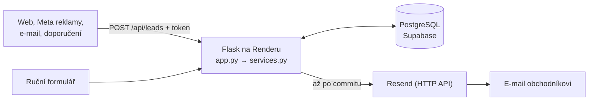

# Lorham: interní systém pro správu poptávek

Prototyp pro firmu, která dostává 100–150 poptávek měsíčně z webu, Meta reklam, e-mailu a doporučení. Každá poptávka má vlastníka, stav a historii aktivit a je vidět, když se jí nikdo nevěnuje.

## 1. Odkazy

Aplikace běží na https://lorham-test.onrender.com/. Je na free tieru Renderu, takže po nečinnosti usne a první načtení chvíli trvá.

Přihlášení v prototypu nahrazuje přepínač „pracuji jako“ v horní liště. Vyberete uživatele a aplikace jedná jeho jménem.

## 2. Jak jsem pochopil problém

Firmě nejde o data, ale o odpovědnost a rychlost reakce. Neobsloužený lead z Meta reklam je vyhozený reklamní rozpočet. Při 5–7 poptávkách denně nemá smysl řešit škálování. Důležitější je přehlednost a aby to lidé opravdu používali, takže systém musí být jednodušší než e-mail.

Každá poptávka proto má od vzniku jmenovitého vlastníka a vedoucí vidí zanedbané poptávky, aniž se musí ptát. Dashboard ukazuje průměrnou dobu první reakce po obchodnících, takže zlepšení půjde změřit. Skutečný dopad zatím změřený nemám, prototyp běží na ukázkových datech.

## 3. Co systém umí

Seznam poptávek má filtry podle stavu, obchodníka, zdroje a „jen zanedbané“. Obchodník v něm vidí defaultně jen své poptávky. V detailu je historie aktivit (hovor, e-mail, schůzka, poznámka), změna stavu a přiřazení. Poptávku lze založit ručně, obchodníka zvolit, nechat vybrat automaticky nebo nechat nepřiřazeno. Vedoucí má dashboard s počty podle stavu, obchodníka a zdroje, zanedbanými poptávkami, průměrnou dobou reakce a zvýrazněnými nepřiřazenými poptávkami.

Dvě věci se dějí automaticky.

- Webhook `POST /api/leads` (chráněný tokenem, s validací) založí poptávku a hned ji přiřadí obchodníkovi s nejmenším počtem otevřených poptávek.
- Nově přiřazený obchodník dostane e-mail se zdrojem, zkráceným textem poptávky a odkazem na detail. Doručení jsem ověřil lokálně i na Renderu.

SLA příznaky se počítají při čtení, bez plánovaných úloh. Červený štítek „bez reakce“ dostane nová poptávka, na kterou nikdo nereagoval déle než 2 hodiny. Oranžový štítek „usnulá“ dostane otevřená poptávka bez aktivity déle než 3 dny. Zanedbané poptávky jsou v seznamu nahoře. Za reakci se počítá první ruční aktivita nebo změna stavu z „Nová“. Samotné přiřazení ne, protože není kontaktem se zákazníkem.

Vzhled vychází z identity lorham.cz: teplé bílé pozadí, jedna zelená jako akcent a písma Instrument Sans a Inter Tight. Barvy a písma jsou přečtené přímo z CSS webu. Kontrast textu na seznamu, detailu, nové poptávce i dashboardu byl změřen a vychází nad WCAG AA (4,5 : 1).

## 4. Architektura a technologie



Reálné napojení na Meta ani na příchozí poštu prototyp nemá. Příchozí poptávky zatím simuluje skript `scripts/send_test_lead.py`.

- Python a Flask, protože Python znám a Flask je malý a čitelný. Stránky se vykreslují na serveru.
- Jinja2 šablony a Pico.css z CDN. Vzhled Lorhamu je přepsaný v jednom souboru, `static/style.css`, písma jdou z Google Fonts. Žádný JavaScript.
- PostgreSQL na Supabase, jen jako hostovaná databáze, bez Supabase Auth a SDK.
- psycopg 3 s čistým SQL a parametry, bez ORM.
- Render a gunicorn pro hosting nasazovaný z GitHubu.
- Resend pro odesílání e-mailů přes HTTP API.

## 5. Klíčová rozhodnutí

1. Python, Flask a Postgres místo Next.js. Zbývaly 3 dny, Next.js ani React jsem nikdy nedělal a každý řádek musím umět obhájit. Hostovaný Postgres navíc přežije redeploy. Platím za to méně interaktivním UI a tím, že free tier usíná.

2. Reakce se nerovná přiřazení a SLA se počítá při čtení. Přiřazení není kontakt se zákazníkem a právě tenhle rozdíl firmu bolí. Výpočet při čtení nepotřebuje plánované úlohy. Neřeším pracovní dobu a víkendy a zanedbané poptávky se jen zobrazí, nikam nevolají.

3. Auto-přiřazení nejméně vytíženému obchodníkovi, při shodě nižší id, a vedoucí může přeřadit. Je to férové a stačí jeden SQL dotaz bez ukládání stavu, zatímco samovýběr vede k vybírání lepších leadů a k nepřiřazeným poptávkám. Neřeším specializaci ani dovolenou, neaktivní obchodníky ale vynechávám.

4. Bez plnohodnotného přihlašování. Auth by snědlo velkou část rozpočtu a není jádro problému. Prototyp proto není bezpečný pro reálná data, kdokoli může jednat jako kdokoli.

5. E-mail se posílá až po commitu transakce a jeho selhání se jen zaloguje. E-mail nejde vzít zpět, transakce ano, takže po rollbacku by přišel odkaz na poptávku, která neexistuje. A kdyby chyba e-mailu shodila webhook, odesílatel by poslal stejnou poptávku znovu a vznikl by duplikát. Selhání je pak vidět jen v logu a nezkouší se znovu. Z toho vyplývá i volba Resendu přes HTTP API místo SMTP, protože Render na free tieru blokuje porty 25, 465 a 587 a e-mail by lokálně fungoval, ale na produkci tiše padal. Platím závislostí na cizí službě a ručním skládáním HTTP požadavku.

## 6. Vlastní kód vs. externí nástroje

Veškerá logika je v Pythonu v tomto repu: založení a přiřazení poptávky, změny stavu, aktivity, SLA, validace webhooku, složení a odeslání e-mailu (přes `urllib` ze standardní knihovny, bez další závislosti). Žádný řádek jsem nenapsal ručně. Psal ho Claude Code, já jsem zadával kroky, kontroloval výsledek a navrhoval další funkce.

Externí jsou služby Supabase (jen databáze), Render (hosting) a Resend (doručení e-mailu) a knihovny Flask, psycopg, gunicorn a Pico.css.

S AI jsem pracoval takhle:

- Claude chat mi sloužil na plánování a rozhodnutí (stack, pravidla SLA, rozsah).
- Claude Code psal implementaci po malých krocích, jeden krok byla jedna funkce nebo soubor.
- `CLAUDE.md` je řídicí dokument se stackem, datovým modelem, byznys pravidly, pořadím kroků a pracovními pravidly. Před změnou napíše plán a počká na moje OK, dělá malé diffy, vysvětluje nové pojmy, nepřidává závislosti bez souhlasu a commity dělám já.
- Plán jsem schvaloval a hotový krok kontroloval já. Blokaci SMTP na Renderu odhalil Claude chat při plánování a do implementace jsem ji zadal já. AI navrhlo plán, vysvětlilo, proč posílat e-mail až po commitu, napsalo kód a testy a já ověřil doručení.
- Identitu Lorhamu jsem vzal ze své knihovny inspirací, kde jsou hodnoty přečtené z CSS lorham.cz. AI je aplikovalo jen do `static/style.css` a importu písem v `base.html`, šablony a funkčnost se nezměnily. Vzhled všech stránek se po úpravě kontroloval v prohlížeči a výsledek jsem schválil já.
- Automatizované testy v repu nejsou. Testy proti falešnému serveru a skutečné databázi běžely jednorázově při vývoji.

## 7. Úpravy pro produkci

- Skutečné přihlášení a role místo přepínače „pracuji jako“.
- E-mail: ověřit doménu firmy v Resendu a použít její adresu v `EMAIL_FROM`. Bez ověřené domény Resend v testovacím režimu doručuje jen na adresu vlastníka účtu. `APP_BASE_URL` nastavit na adresu aplikace.
- E-maily odesílat na pozadí (fronta nebo vlákno) a po chybě opakovat. Dnes při výpadku Resendu webhook čeká až 5 s.
- Každý dotaz otevírá nové spojení do databáze. V produkci by se použilo jedno spojení na požadavek nebo connection pool.
- Dvě poptávky přijaté ve stejný okamžik mohou dostat stejného obchodníka, protože se nezamyká.
- Dashboard ukazuje jen aktivní obchodníky a průměrnou dobu reakce počítá podle aktuálního obchodníka. Čísla nejsou z jednoho snímku dat.
- Tmavý režim je vypnutý, protože identita Lorhamu je jen světlá. Písma se načítají z Google Fonts, v produkci by bylo lepší hostovat je vlastní.
- Automatizované testy a placená instance hostingu, která neusíná.

## 8. Další verze

Jako první by přibylo aktivní upozornění na zanedbané poptávky: denní souhrn e-mailem vedoucímu přes plánovanou úlohu. Dnes se zanedbané poptávky jen zobrazí tomu, kdo se zrovna dívá. Záměrně mimo prototyp zůstalo reálné Meta Lead Ads API, parsování příchozích e-mailů, AI klasifikace a scoring leadů, přiřazování podle úspěšnosti obchodníka, deduplikace kontaktů, pracovní doba a víkendy v SLA, editace a mazání poptávek a stránkování. Dál by přibyla podrobnější doba reakce (medián, rozpad po zdrojích), upozornění i původnímu obchodníkovi při přeřazení a detail poptávky ve dvou sloupcích, s informacemi vlevo a akcemi vpravo.

## 9. Lokální spuštění

Potřebujete Python 3.14 a databázi PostgreSQL (já použil Supabase, Session pooler).

```bash
pip install -r requirements.txt
cp .env.example .env             # doplňte DATABASE_URL, SECRET_KEY, WEBHOOK_TOKEN
flask --app app run --debug      # http://localhost:5000
```

Databázi připravíte tak, že v SQL editoru spustíte `sql/schema.sql` a potom `sql/seed.sql` (ukázkoví uživatelé a poptávky s různě starými časy kvůli SLA). `RESEND_API_KEY` je nepovinný, bez něj se e-mail jen vypíše do logu (dry-run). Produkční start je `gunicorn app:app`.

Test webhooku:

```bash
curl -X POST http://localhost:5000/api/leads \
  -H "Content-Type: application/json" \
  -H "X-Webhook-Token: <token>" \
  -d '{"name":"Jan Novák","email":"jan@example.com","message":"Zájem o nabídku","source":"meta"}'
```

Úspěch vrátí `201` s `id` a `assigned_to`, špatný token `401`, nevalidní data `400` s popisem chyby. Pro demo lze použít i `python scripts/send_test_lead.py meta` (zdroj `web`, `meta` nebo `email`, URL a token se berou z proměnných prostředí `WEBHOOK_URL` a `WEBHOOK_TOKEN`).
